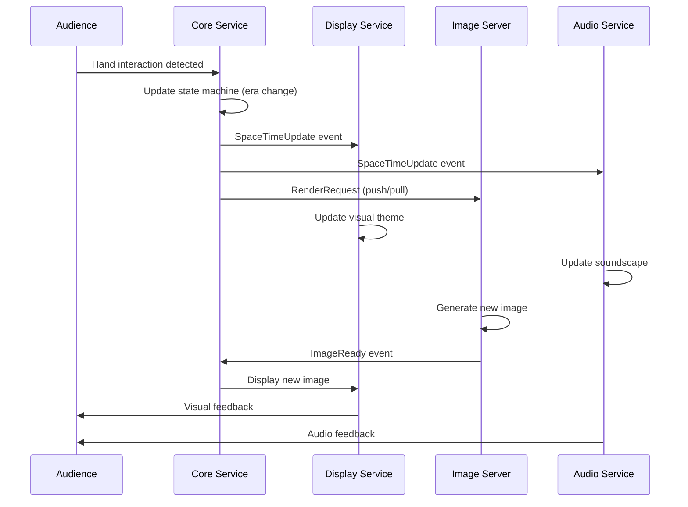

# Experimance System Architecture

This document provides a comprehensive overview of the Experimance system architecture, including service interactions, communication patterns, and data flow.

## Table of Contents

1. [System Overview](#system-overview)
2. [Service Architecture](#service-architecture)
3. [Communication Patterns](#communication-patterns)
4. [Data Flow](#data-flow)
5. [Project System](#project-system)
6. [Deployment Architecture](#deployment-architecture)
7. [Scalability Considerations](#scalability-considerations)

## System Overview

Experimance is a distributed, event-driven system designed for interactive art installations. The architecture follows microservices principles with ZeroMQ-based communication for real-time coordination.

### Core Principles

- **Event-Driven**: Services communicate through events rather than direct calls
- **Loosely Coupled**: Services can be developed, deployed, and scaled independently
- **Fault Tolerant**: Services can recover from failures and continue operation
- **Real-Time**: Low-latency communication for interactive experiences
- **Modular**: Components can be mixed and matched for different installations

### High-Level Architecture

```
┌─────────────────────────────────────────────────────────────────┐
│                    Experimance Installation                     │
├─────────────────────────────────────────────────────────────────┤
│                                                                 │
│  ┌─────────────┐    ┌─────────────┐    ┌─────────────┐         │
│  │   Audience  │    │  Physical   │    │   Display   │         │
│  │ Interaction │◄──►│ Environment │◄──►│   Output    │         │
│  └─────────────┘    └─────────────┘    └─────────────┘         │
│         │                   │                   │              │
│         ▼                   ▼                   ▼              │
│  ┌─────────────┐    ┌─────────────┐    ┌─────────────┐         │
│  │   Sensors   │    │    Core     │    │   Display   │         │
│  │  (Cameras)  │───►│   Service   │───►│   Service   │         │
│  └─────────────┘    └─────────────┘    └─────────────┘         │
│                             │                                  │
│                             ▼                                  │
│  ┌─────────────┐    ┌─────────────┐    ┌─────────────┐         │
│  │    Agent    │◄──►│     ZMQ     │◄──►│   Image     │         │
│  │   Service   │    │ Event Bus   │    │   Server    │         │
│  └─────────────┘    └─────────────┘    └─────────────┘         │
│         │                   │                   │              │
│         ▼                   ▼                   ▼              │
│  ┌─────────────┐    ┌─────────────┐    ┌─────────────┐         │
│  │   Audio     │    │   Health    │    │ Transition  │         │
│  │   Service   │    │   Monitor   │    │   Service   │         │
│  └─────────────┘    └─────────────┘    └─────────────┘         │
│                                                                 │
└─────────────────────────────────────────────────────────────────┘
```

## Service Architecture

### Core Services

#### 1. Core Service (`experimance_core`)
**Role**: Central orchestrator and state machine

```
┌─────────────────────────────────────────┐
│              Core Service               │
├─────────────────────────────────────────┤
│                                         │
│  ┌─────────────┐  ┌─────────────────┐   │
│  │   State     │  │   Interaction   │   │
│  │  Machine    │  │   Detection     │   │
│  │             │  │                 │   │
│  │ • Era       │  │ • Depth Camera  │   │
│  │ • Biome     │  │ • Hand Tracking │   │
│  │ • Presence  │  │ • Change Detect │   │
│  └─────────────┘  └─────────────────┘   │
│         │                   │           │
│         ▼                   ▼           │
│  ┌─────────────────────────────────┐    │
│  │        Event Publisher          │    │
│  │                                 │    │
│  │ • SpaceTimeUpdate              │    │
│  │ • PresenceStatus               │    │
│  │ • RenderRequest                │    │
│  └─────────────────────────────────┘    │
│                                         │
└─────────────────────────────────────────┘
```

**Key Responsibilities**:
- Process depth camera data for interaction detection
- Manage experience state (era, biome, presence)
- Coordinate other services through events
- Handle hardware interfaces (cameras, sensors)

#### 2. Display Service (`experimance_display`)
**Role**: Visual output and rendering

```
┌─────────────────────────────────────────┐
│             Display Service             │
├─────────────────────────────────────────┤
│                                         │
│  ┌─────────────┐  ┌─────────────────┐   │
│  │   Image     │  │     Video       │   │
│  │ Rendering   │  │   Playback      │   │
│  │             │  │                 │   │
│  │ • Layers    │  │ • Transitions   │   │
│  │ • Effects   │  │ • Overlays      │   │
│  │ • Shaders   │  │ • Text Display  │   │
│  └─────────────┘  └─────────────────┘   │
│         │                   │           │
│         ▼                   ▼           │
│  ┌─────────────────────────────────┐    │
│  │         OpenGL Output           │    │
│  │                                 │    │
│  │ • Fullscreen Display           │    │
│  │ • Multi-monitor Support        │    │
│  │ • Hardware Acceleration        │    │
│  └─────────────────────────────────┘    │
│                                         │
└─────────────────────────────────────────┘
```

**Key Responsibilities**:
- Render images and videos to display hardware
- Handle smooth transitions between content
- Apply visual effects and overlays
- Manage multiple display outputs

#### 3. Image Server (`image_server`)
**Role**: AI-powered content generation

```
┌─────────────────────────────────────────┐
│             Image Server                │
├─────────────────────────────────────────┤
│                                         │
│  ┌─────────────┐  ┌─────────────────┐   │
│  │    Local    │  │     Remote      │   │
│  │ Generators  │  │   Generators    │   │
│  │             │  │                 │   │
│  │ • Diffusers │  │ • Vast.ai       │   │
│  │ • ComfyUI   │  │ • Fal.ai        │   │
│  │ • Flux      │  │ • Runware       │   │
│  └─────────────┘  └─────────────────┘   │
│         │                   │           │
│         ▼                   ▼           │
│  ┌─────────────────────────────────┐    │
│  │        Generation Queue         │    │
│  │                                 │    │
│  │ • Priority Handling            │    │
│  │ • Load Balancing               │    │
│  │ • Caching System               │    │
│  └─────────────────────────────────┘    │
│                                         │
└─────────────────────────────────────────┘
```

**Key Responsibilities**:
- Generate images based on era/biome context
- Manage multiple generation backends
- Handle request queuing and prioritization
- Provide caching for performance

#### 4. Agent Service (`experimance_agent`)
**Role**: Conversational AI and vision processing

```
┌─────────────────────────────────────────┐
│             Agent Service               │
├─────────────────────────────────────────┤
│                                         │
│  ┌─────────────┐  ┌─────────────────┐   │
│  │ Conversation│  │     Vision      │   │
│  │     AI      │  │   Processing    │   │
│  │             │  │                 │   │
│  │ • STT       │  │ • Face Detect   │   │
│  │ • LLM       │  │ • Object Detect │   │
│  │ • TTS       │  │ • VLM Analysis  │   │
│  └─────────────┘  └─────────────────┘   │
│         │                   │           │
│         ▼                   ▼           │
│  ┌─────────────────────────────────┐    │
│  │         Tool Integration        │    │
│  │                                 │    │
│  │ • Biome Control                │    │
│  │ • System Commands              │    │
│  │ • Context Awareness            │    │
│  └─────────────────────────────────┘    │
│                                         │
└─────────────────────────────────────────┘
```

**Key Responsibilities**:
- Provide conversational interface with visitors
- Process camera feeds for audience detection
- Integrate with system through tool calls
- Maintain conversation context and memory

#### 5. Audio Service (`experimance_audio`)
**Role**: Spatial audio and sound design

```
┌─────────────────────────────────────────┐
│             Audio Service               │
├─────────────────────────────────────────┤
│                                         │
│  ┌─────────────┐  ┌─────────────────┐   │
│  │ SuperCollider│  │    Spatial      │   │
│  │   Engine    │  │     Audio       │   │
│  │             │  │                 │   │
│  │ • Synthesis │  │ • Multi-channel │   │
│  │ • Effects   │  │ • 3D Positioning│   │
│  │ • Sequencing│  │ • Room Modeling │   │
│  └─────────────┘  └─────────────────┘   │
│         │                   │           │
│         ▼                   ▼           │
│  ┌─────────────────────────────────┐    │
│  │        Audio Routing            │    │
│  │                                 │    │
│  │ • Hardware Interfaces          │    │
│  │ • Channel Mapping              │    │
│  │ • Latency Compensation         │    │
│  └─────────────────────────────────┘    │
│                                         │
└─────────────────────────────────────────┘
```

**Key Responsibilities**:
- Generate environmental soundscapes
- Provide audio feedback for interactions
- Manage spatial audio positioning
- Handle multi-channel audio output

### Support Services

#### Health Monitor (`experimance_health`)
- Monitors all service health status
- Sends alerts for failures
- Provides web dashboard for monitoring
- Manages automatic service recovery

#### Transition Service (`experimance_transition`)
- Creates smooth video transitions between images
- Applies artistic effects during transitions
- Manages transition timing and coordination

## Communication Patterns

### ZeroMQ Architecture

Experimance uses ZeroMQ for inter-service communication with two primary patterns:

#### 1. Publisher-Subscriber (Events)

```
┌─────────────┐     Events     ┌─────────────┐
│    Core     │ ──────────────► │   Display   │
│   Service   │                │   Service   │
│             │                │             │
│ Publisher   │                │ Subscriber  │
│ (tcp:5555)  │                │ (tcp:5555)  │
└─────────────┘                └─────────────┘
       │                              ▲
       │                              │
       ▼                              │
┌─────────────┐                ┌─────────────┐
│   Image     │                │    Agent    │
│   Server    │                │   Service   │
│             │                │             │
│ Subscriber  │                │ Subscriber  │
│ (tcp:5555)  │                │ (tcp:5555)  │
└─────────────┘                └─────────────┘
```

**Event Types**:
- `SpaceTimeUpdate`: Era/biome changes
- `PresenceStatus`: Audience presence detection
- `RenderRequest`: Image generation requests
- `ImageReady`: Generated content available
- `AudioReady`: Audio content available

#### 2. Push-Pull (Work Distribution)

```
┌─────────────┐     Work       ┌─────────────┐
│    Core     │ ──────────────► │   Image     │
│   Service   │                │   Server    │
│             │                │             │
│   Pusher    │                │   Puller    │
│ (tcp:5561)  │                │ (tcp:5561)  │
└─────────────┘                └─────────────┘
       │                              │
       │         Results              │
       │ ◄────────────────────────────┘
       ▼                              
┌─────────────┐                
│   Results   │                
│   Puller    │                
│ (tcp:5562)  │                
└─────────────┘                
```

**Work Types**:
- Image generation requests
- Audio processing tasks
- Video transition rendering
- Background processing jobs

### Message Schema

All messages use Pydantic models for type safety and validation:

```python
# Example message schemas
class SpaceTimeUpdate(BaseModel):
    era: Era
    biome: Biome
    timestamp: datetime
    source: str

class RenderRequest(BaseModel):
    era: Era
    biome: Biome
    prompt: str
    priority: int = 0
    metadata: Dict[str, Any] = {}

class ImageReady(BaseModel):
    request_id: str
    image_path: str
    metadata: Dict[str, Any]
    generation_time: float
```

## Data Flow

### Typical Interaction Flow

```
1. Audience Interaction
   │
   ▼
2. Depth Camera Detection (Core Service)
   │
   ▼
3. State Machine Update (Era/Biome Change)
   │
   ▼
4. Event Publication (SpaceTimeUpdate)
   │
   ├─► Display Service (Update Visuals)
   ├─► Audio Service (Update Soundscape)
   ├─► Agent Service (Update Context)
   └─► Image Server (Generate New Content)
       │
       ▼
5. Content Generation
   │
   ▼
6. Content Ready Events
   │
   ▼
7. Display/Audio Updates
   │
   ▼
8. Audience Experiences Change
```

### Detailed Flow Example



## Project System

### Multi-Project Architecture

Experimance supports multiple installation projects through a dynamic loading system:

```
projects/
├── .project                 # Current active project
├── experimance/            # Default project
│   ├── .env
│   ├── config.toml
│   ├── constants.py
│   ├── schemas.py
│   └── *.toml             # Service configs
├── fire/                  # Feed the Fires project
│   ├── .env
│   ├── config.toml
│   ├── constants.py
│   ├── schemas.py
│   └── *.toml
└── custom_project/        # Your custom project
    ├── .env
    ├── config.toml
    ├── constants.py
    ├── schemas.py
    └── *.toml
```

### Schema Extension Pattern

Projects can extend base schemas for custom functionality:

```python
# Base schema (libs/common/src/experimance_common/schemas_base.py)
class RenderRequest(BaseModel):
    prompt: str
    priority: int = 0

# Project-specific schema (projects/fire/schemas.py)
from experimance_common.schemas_base import RenderRequest as _BaseRenderRequest

class RenderRequest(_BaseRenderRequest):
    fire_intensity: float  # Project-specific field
    community_theme: str   # Project-specific field
```

## Deployment Architecture

### Development Deployment

```
┌─────────────────────────────────────────┐
│           Developer Machine             │
├─────────────────────────────────────────┤
│                                         │
│  Terminal 1: Core Service               │
│  Terminal 2: Display Service            │
│  Terminal 3: Image Server               │
│  Terminal 4: Audio Service              │
│  Terminal 5: Agent Service              │
│                                         │
│  All services run in foreground        │
│  Logs visible in terminals             │
│  Easy debugging and development         │
│                                         │
└─────────────────────────────────────────┘
```

### Production Deployment

```
┌─────────────────────────────────────────┐
│          Installation Computer          │
├─────────────────────────────────────────┤
│                                         │
│  ┌─────────────────────────────────┐    │
│  │         systemd Services        │    │
│  │                                 │    │
│  │  experimance-core@project       │    │
│  │  experimance-display@project    │    │
│  │  experimance-image@project      │    │
│  │  experimance-audio@project      │    │
│  │  experimance-agent@project      │    │
│  │  experimance-health@project     │    │
│  │                                 │    │
│  └─────────────────────────────────┘    │
│                                         │
│  ┌─────────────────────────────────┐    │
│  │         Monitoring              │    │
│  │                                 │    │
│  │  • Health Dashboard (Web)       │    │
│  │  • Email Alerts                │    │
│  │  • Log Aggregation             │    │
│  │  • Automatic Recovery          │    │
│  │                                 │    │
│  └─────────────────────────────────┘    │
│                                         │
└─────────────────────────────────────────┘
```

### Distributed Deployment

For large installations or high-performance requirements:

```
┌─────────────────┐    ┌─────────────────┐    ┌─────────────────┐
│   Control Node  │    │   Compute Node  │    │  Display Node   │
├─────────────────┤    ├─────────────────┤    ├─────────────────┤
│                 │    │                 │    │                 │
│ • Core Service  │    │ • Image Server  │    │ • Display Svc   │
│ • Agent Service │    │ • GPU Workers   │    │ • Audio Service │
│ • Health Monitor│    │ • Transition    │    │ • Hardware I/O  │
│                 │    │                 │    │                 │
└─────────────────┘    └─────────────────┘    └─────────────────┘
         │                       │                       │
         └───────────────────────┼───────────────────────┘
                                 │
                    ┌─────────────────┐
                    │   Network Hub   │
                    │                 │
                    │ • ZMQ Routing   │
                    │ • Load Balancer │
                    │ • Service Mesh  │
                    │                 │
                    └─────────────────┘
```

## Scalability Considerations

### Horizontal Scaling

- **Image Generation**: Multiple image server instances with load balancing
- **Audio Processing**: Distributed audio workers for complex soundscapes
- **Display Outputs**: Multiple display nodes for large installations
- **Agent Services**: Multiple agents for different interaction zones

### Performance Optimization

- **Caching**: Generated content caching to reduce regeneration
- **Preloading**: Predictive content generation based on interaction patterns
- **Resource Management**: Dynamic resource allocation based on demand
- **Network Optimization**: Message batching and compression for high-frequency data

### Fault Tolerance

- **Service Recovery**: Automatic restart of failed services
- **Graceful Degradation**: System continues with reduced functionality
- **State Persistence**: Critical state saved to survive restarts
- **Health Monitoring**: Proactive detection and alerting of issues

This architecture provides a robust foundation for creating interactive art installations that can scale from small prototypes to large-scale public installations while maintaining real-time responsiveness and reliability.